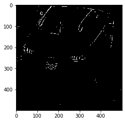

# License Plate Detection with OpenCV

In this project we demonstrate how to use OpenCV only, with traditional computer vision approaches, to perform License Plate Detection (LPD). 

We follow two approaches:

1- __Morphology based approach__: where only morphological transforms are used, along with some rules to detect the LP.

2- __Charater based approach__: in addition to basic morphological approaches, basic char detection, also based on morphology, is used as an extra characteristic of the LP.

Further, the problem of Licence Plate Recognition (LPR), by recognizing the number and digits written, can be addressed by the second approach.

In both approaches, we load HD videos (1080p). Due to the camera position, this is the most effective resolution to detect LP patterns.

In both approaches we merge car detection, using background subtraction, to narrow the search space.

For more details, please see [full documentation](doc/DOC.md), and the executable example [notebook](doc/LPD.ipynb), and for all functions and internal code details in one plain notebook, please see this [notebook](doc/doc_code_inside.ipynb)

# Pre-requisites

You need to install the packages in `requirements.txt`:
    
`pip install -r requirements.txt`

# How to run?

## Usage
`!python main.py --help`

```
usage: License Plate Detector (LPD) [-h] [--video_file VIDEO_FILE]
                                    [--video_output_file VIDEO_OUTPUT_FILE]
                                    [--frames_cnt FRAMES_CNT]
                                    [--cars_detection CARS_DETECTION]
                                    [--show_cars_bbox SHOW_CARS_BBOX]
                                    [--detect_LP_fn DETECT_LP_FN]
                                    [--debug DEBUG]

optional arguments:
  -h, --help            show this help message and exit
  --video_file VIDEO_FILE
                        the path to the input video
  --video_output_file VIDEO_OUTPUT_FILE
                        the path to the output video
  --frames_cnt FRAMES_CNT
                        The desired number of frames to process. If None the
                        whole video is processed.
  --cars_detection CARS_DETECTION
                        LPD will work on the car cropped image or whole image.
  --show_cars_bbox SHOW_CARS_BBOX
                        0: no cars shown, 1: bbox shown, 2: oriented bbox
                        shown
  --detect_LP_fn DETECT_LP_FN
                        The desired LPD method, 0: char, 1: morphology. If not
                        passed no LPs are detected.
  --debug DEBUG         Set to True to see intermediate outputs and debug logs
```
You can run over a video, or single image as follows:

## Video input
You can call the `process_video` as follows:


```python
from char import detect_LP
video_file = 'dat/detection_test.mp4'
video_output_file = 'dat/char_LP_detection.mp4'
process_video(video_file, video_output_file, detect_LP_fn=detect_LP)
```

    100%|██████████| 2171/2171 [03:35<00:00, 10.09it/s]

    Video is ready at:  dat/char_LP_detection.mp4


    


Note that, you can choose the approach by importing `detect_LP` from char or morpho 

You can also do the same from the command line:


```python
!python main.py --video_file dat/detection_test.mp4 --video_output_file dat/cars_detection.mp4 --detect_LP_fn 1
```

    OpenCV: FFMPEG: tag 0x47504a4d/'MJPG' is not supported with codec id 7 and format 'mp4 / MP4 (MPEG-4 Part 14)'
    OpenCV: FFMPEG: fallback to use tag 0x7634706d/'mp4v'
    100%|███████████████████████████████████████| 2171/2171 [03:35<00:00, 10.06it/s]
    Video is ready at:  dat/cars_detection.mp4


## Single image
You can use the `char.detect_LP` or `morpho.detect_LP`


```python
from char import detect_LP
img  = cv2.imread("imgs/char_frame_180_car_no_lp1.png")
plot_img(img)
detected_img, LPs = detect_LP_char(img)
plot_img(detected_img)
```


You can further debug, and calibrate the rules via the internal functions `char.detect_LP_char` or `char.detect_LP_morpho`


```python
from morpho import detect_LP_morpho
img  = cv2.imread("imgs/char_frame_180_car_no_lp1.png")
plot_img(img)
detected_img, LPs = detect_LP_morpho(cv2.resize(img, (500,500)), L_min=35, L_max=60, W_min=55, W_max=90, debug=True)
plot_img(detected_img)
```





# References
- https://www.pyimagesearch.com/2015/05/25/basic-motion-detection-and-tracking-with-python-and-opencv/
- https://sod.pixlab.io/articles/license-plate-detection.html
- https://github.com/MicrocontrollersAndMore/OpenCV_3_License_Plate_Recognition_Python.git
